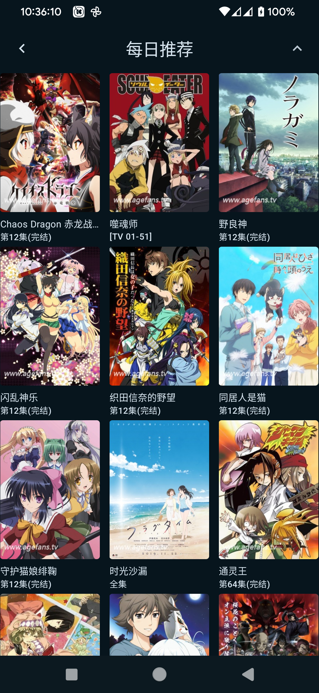
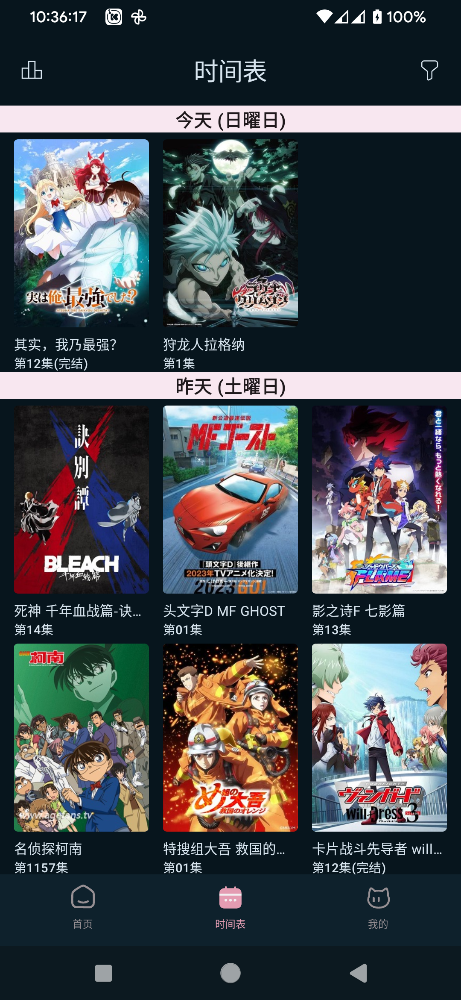
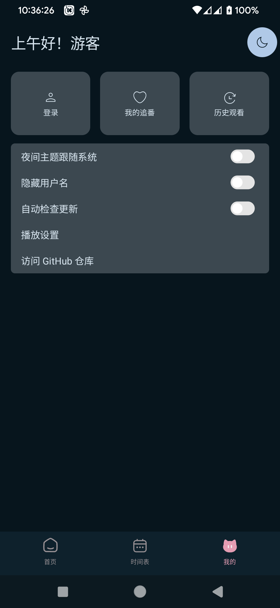

# AGE动漫

使用 [AGE动漫](https://www.agemys.com/) API 编写的第三方客户端。

#### 应用截图
<table>
<tr>
    <td align=center>首页</td>
    <td align=center>目录</td>
    <td align=center>推荐</td>
    <td align=center>排行榜</td>
  </tr>
  <tr>
    <td></td>
    <td></td>
    <td></td>
    <td></td>
  </tr>

 <tr>
    <td colspan=4>播放界面</td>
  </tr>
  <tr>
    <td colspan=4></td>
  </tr>

</table>

## 请您遵守使用规则

本软件仅供学习交流使用, 本软件或本软件的拓展, 个人或企业不可用于商业用途, 不可上架任何商店

拓展包括但是不限于以下内容

- 使用本软件进行继续开发形成的软件。
- 引入本软件部分内容为依赖/参考本软件/使用本软件内代码的同时, 包含本软件内一致内容或功能的软件。
- 直接对本软件进行打包发布

软件副本分发规则

- 不要在任何其他 **二次元软件** 的 **聊天社区** 或 **开发社区** 内, 发布有关本软件的链接或信息
- 不要发送本软件安装包到 **任何社区内** , 不要将APK发送包括任何聊天软件内的群聊功能。 分享本软件时, 在社区中使用Github中提供的Releases页面的链接, 或使用私聊窗口发送。
- 作者不对分发软件承担任何后果, 请您遵守当地以及副本接受社区或副本接收人所在地区的法律。